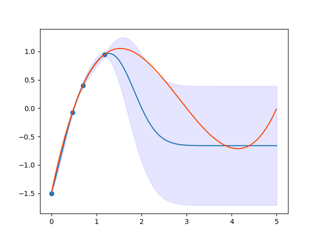

# Searching a maximum value of function

Please refer to [OneMax problem's tutorial](./ONEMAX.md).

We visualize the function of Gaussian process regression and reveal how to optimize by BO.

## Preparation
We define the simulator as 
```Python
def simulator(actions:int) -> float:
    x = alpha_val[actions][0]
    fx = 0.1 * ( 2 * x - 1 ) * ( x - 3 ) * ( x - 5 ) 
    alpha_action.append(x)
    fx_action.append(fx)
    return fx
```
Discretize parameter space
```Python
window_num=10001
alpha_max = 5.0
alpha_min = 0.0
alpha_action = []
fx_action = []
alpha_val = np.linspace(alpha_min,alpha_max,window_num).reshape(window_num, 1)
```
We carry out random search and BO
```Python
policy = physbo.search.discrete.policy(test_X=alpha_val)
policy.set_seed(10)
policy.random_search(max_num_probes=1, simulator=simulator)
policy.bayes_search(max_num_probes=10, simulator=simulator, score="EI", interval=1, num_rand_basis=500)
```
## Visualized
We can get the function of Gaussian process regression
by `policy.get_post_fmean` and `policy.get_post_fcov`
```Python
mean = policy.get_post_fmean(X)
var  = policy.get_post_fcov(X)
```
We can reveal how to optimize as
```Python
def plotfig(policy, X, Figname):
    mean = policy.get_post_fmean(X)
    var = policy.get_post_fcov(X)
    std = np.sqrt(var)

    x = X[:,0]
    fig, ax = plt.subplots()
    ax.plot(x, mean)
    ax.fill_between(x, (mean-std), (mean+std), color='b', alpha=.1)
    ax.scatter(alpha_action, fx_action)
    x1 = np.arange(0, 5, 0.01)
    y1 = 0.1 * ( 2 * x1 - 1 ) * ( x1 - 3 ) * ( x1 - 5 ) 
    plt.plot(x1, y1, color='#ff4500')
    #plt.show()
    fig.savefig(Figname) 
```


If you want to visualize an evaluation function, please write this code in plotfig function 
```Python
scores = policy.get_score(mode="EI", xs=X)
fig = plt.figure()
plt.plot(scores)
fig.savefig("EI.png") 
```
