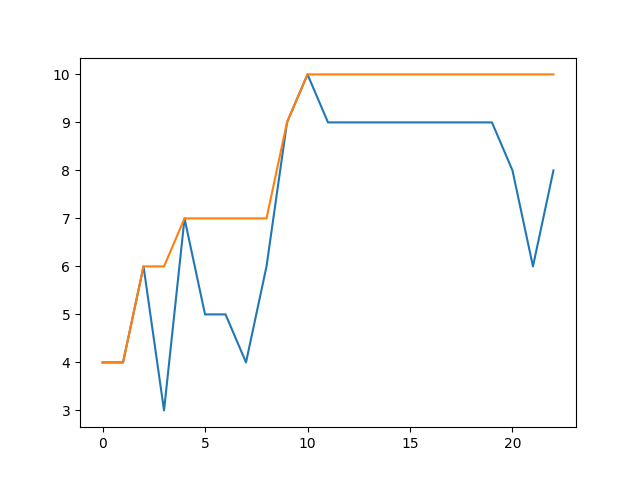
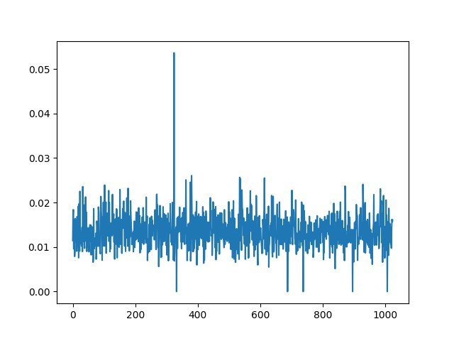

# OneMax Problem
## What is an OneMax problem?
This is the benchmark problem of evolutionary algorithm. The problem is the very simple,
"What is the binary number's array to maximize the function?
This function is defined as the summation of all elements."
Of cource, the answer is very simple. All elements are 1.

We will find this answer automatically by BO.

- J.D. Schaffer and L.J. Eshelman. "On crossover as an evolutionary viable strategy". In R.K. Belew and L.B. Booker, editors. Proceedings of the 4th International Conference on Genetic Algorithms, pages 61-68, Morgan Kaufmann, 1991.
- [The OneMax Problem](https://tracer.lcc.uma.es/problems/onemax/onemax.html#SE91)
- [遺伝的アルゴリズムでOneMax問題を解いてみる](https://qiita.com/pontyo4/items/a986df2582f3d0aaaa40)


## Preparation
Generate binary number's array
```Python
N = 10
X = []
for i in range(2**N):
  Gene = []
    for j in range(N):
      if ((i >> j) & 1):
        Gene.append(1)
      else:
        Gene.append(0)
      X.append(Gene)
```
Set test_X as **numpy's array format, ndarray**
```Python
test_X = np.array(random.sample(X,len(X)))
```
Define a policy,
```Python
policy = physbo.search.discrete.policy(test_X=test_X)
```
test_X is parameter set.

`simulator` is a function which you want to maximize.
```Python
def simulator(actions:int) -> float:
    return np.sum(test_X[actions,:])
```
`actions` is selected ID by PHYSBO. 

## Random search
First, we carry out a random search.
```Python
policy.set_seed(10)
policy.random_search(max_num_probes=3, simulator=simulator)
```
`max_num_probes` is a number of trials.
We can get best values by `policy.history.export_sequence_best_fx()`
```Python
best_fx, best_actions = policy.history.export_sequence_best_fx()
print(f"best_fx: {best_fx[-1]} at {test_X[best_actions[-1]]}")
```
## Bayes search
We can carry out Bayes search by `policy.bayes_search`
```Python
res = policy.bayes_search(max_num_probes=20, simulator=simulator, score="EI", 
    interval=1, num_rand_basis=500)
best_fx, best_actions = policy.history.export_sequence_best_fx()
print(f"best_fx: {best_fx[-1]} at {test_X[best_actions[-1]]}")
```
`score` can be selected in [EI, PI or TS](https://issp-center-dev.github.io/PHYSBO/manual/master/ja/_modules/physbo/search/score.html).

Finally, we get the maximum value and index.
```Bash
best_fx: 10.0 at [1 1 1 1 1 1 1 1 1 1]
```
## Visualized
Searching process can be visualized by matplotlib
```Python
fig = plt.figure()
plt.plot(res.fx[0:res.total_num_search])
best_fx, best_action = res.export_all_sequence_best_fx()
plt.plot(best_fx)
fig.savefig("Search.png")
```

We can visualize an evaluation function by `policy.get_score(mode="EI", xs=test_X)`
```Python
scores = policy.get_score(mode="EI", xs=test_X)
fig = plt.figure()
plt.plot(scores)
fig.savefig("EI_1.png") 
```

