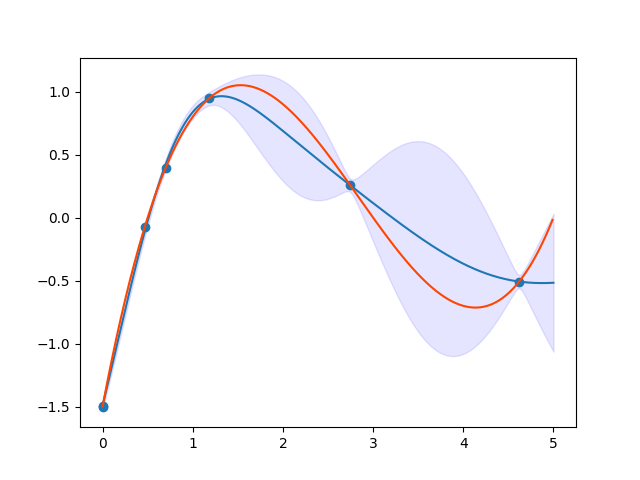

# PHYSBO-Tutorial
How to use PHYSBO for our laboratory

## PHYSBO code
[https://github.com/issp-center-dev/PHYSBO](https://github.com/issp-center-dev/PHYSBO)
## Preparation
**Please clone this repository**
```bash
git clone git@github.com:hikaruri/PHYSBO-Tutorial.git
```
Please prepare python3 and virtual enviroment (How to installation is [here](https://github.com/hikaruri/DFT_startup/blob/main/setup/minimum.md)). 
And, you can install PHYSBO by pip
```bash
pip3 install physbo
pip3 install matplotlib
```
If you want to use jupyter-notebook,
```bash
pip3 install notebook
```
If you want to carry out the LASSO's optimization (this is my hobby),
```bash
pip3 install scikit-learn mglearn
```
Or, please use [MateriApps LIVE!](http://cmsi.github.io/MateriAppsLive/). Release 3.3 includes PHYSBO.
## Tutorial
[Basic Tutorial](./Basic/README.md)

## PHYSBO manual
- [English Manual](https://issp-center-dev.github.io/PHYSBO/manual/master/en/index.html)
- [日本語マニュアル](https://issp-center-dev.github.io/PHYSBO/manual/master/ja/index.html)
- [CCMS Webハンズオン: PHYSBO講習会 (2021/05/24)](https://www.pasums.issp.u-tokyo.ac.jp/physbo/doc/paper)
  - [Tsuda sensei's slides](https://www.pasums.issp.u-tokyo.ac.jp/physbo/wp-content/uploads/sites/12/2021/05/20210524_physbo_guidance.pdf) are written by English.
## References
- Tsuyoshi Ueno, Trevor David Rhone, Zhufeng Hou, Teruyasu Mizoguchi and Koji Tsuda, COMBO: An Efficient Bayesian Optimization Library for Materials Science, Materials Discovery 4, 18-21 (2016). Available from [https://doi.org/10.1016/j.md.2016.04.001](https://doi.org/10.1016/j.md.2016.04.001)
- [https://github.com/tsudalab/combo3](https://github.com/tsudalab/combo3)
  - Almost functions are same as COMBO
- 持橋 大地, 大羽 成征, ガウス過程と機械学習 (機械学習プロフェッショナルシリーズ), 講談社 (2019)
  - 日本語で一番わかりやすい資料
## Buy me a coffee?
<a href="https://www.buymeacoffee.com/hikaruri" target="_blank"></a>
(BTC) 15dY5GPgBLmgKzvwPE9FPG56yc34sYJRxq
